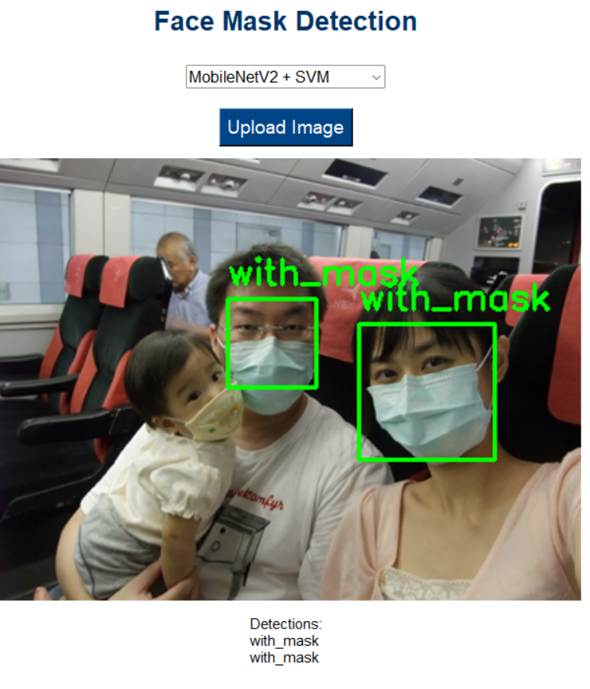
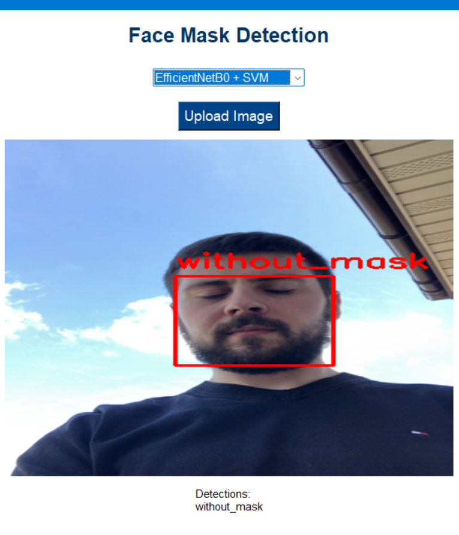
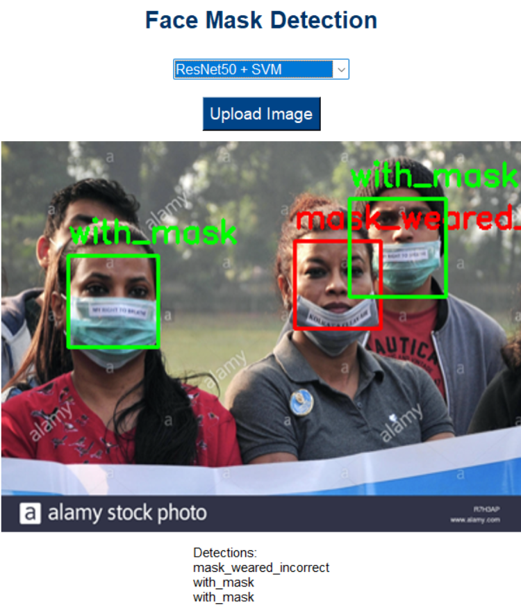
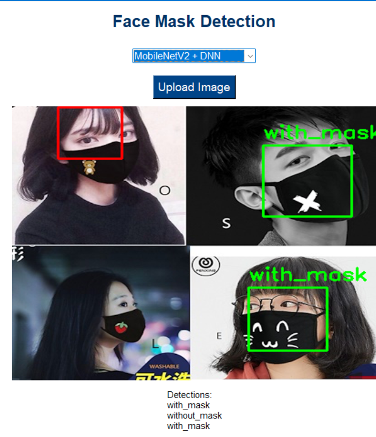
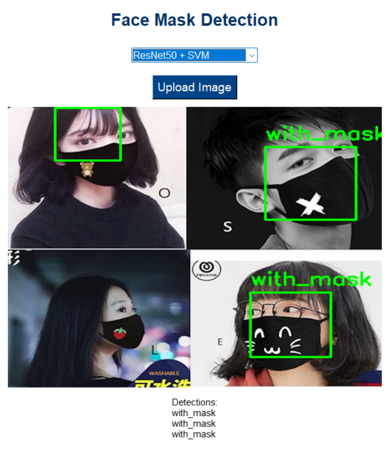
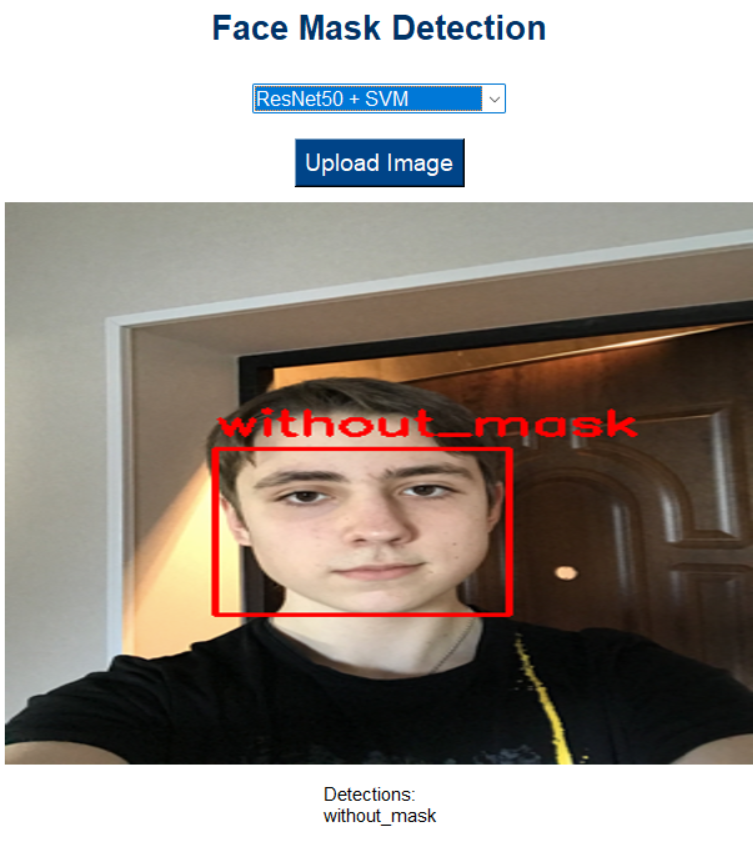

# 😷 Face Mask Detection System with GUI

A complete object detection system to classify whether people are wearing face masks properly, improperly, or not at all — using deep learning, SVM/DNN classifiers, and real-time face detection with MediaPipe. The system includes a Tkinter GUI for easy interaction.

⚠️ Note: The full source code for this project is private. If you are interested in viewing the code, feel free to reach out via [yi559668@gmail.com].
---

## 📸 Demo

### 🧪 Sample Detection Output

---

## 🚀 Features

- ✅ Real-time face detection using MediaPipe
- ✅ Upload and analyze static images through a GUI
- ✅ Multiple model options:
  - MobileNetV2 + SVM
  - EfficientNetB0 + SVM
  - ResNet50 + SVM
  - MobileNetV2 + DNN
- ✅ Visual output: bounding boxes + predicted labels
- ✅ Detailed evaluation using Accuracy & F1-Score

---

## 🧠 Models Used

**Feature Extractors (pretrained on ImageNet):**
- MobileNetV2
- EfficientNetB0
- ResNet50

**Classifiers:**
- Support Vector Machine (SVM) with RBF kernel
- Deep Neural Network (3-layer Dense with Dropout and Softmax)

---

## 🗂️ Dataset

- Format: Pascal VOC (`.xml` annotations)
- Total Samples: 4072 cropped faces
- Classes:
  - `with_mask`
  - `without_mask`
  - `mask_weared_incorrect`

---

## 📊 Evaluation Results

| Model                 | Accuracy | F1-score (Macro) |
|-----------------------|----------|------------------|
| MobileNetV2 + SVM     | 88%      | 0.61             |
| EfficientNetB0 + SVM  | 91%      | 0.67             |
| ResNet50 + SVM        | 93%      | 0.71             |
| MobileNetV2 + DNN     | 92%      | 0.68             |

*Visual confusion matrices and per-class scores available in the final report.*
